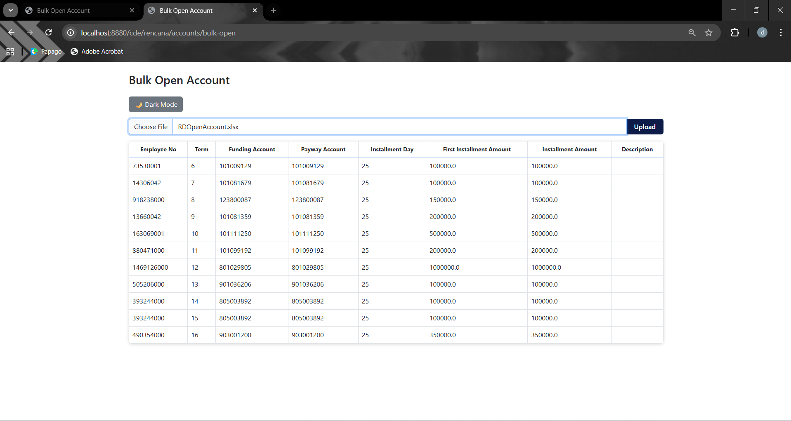
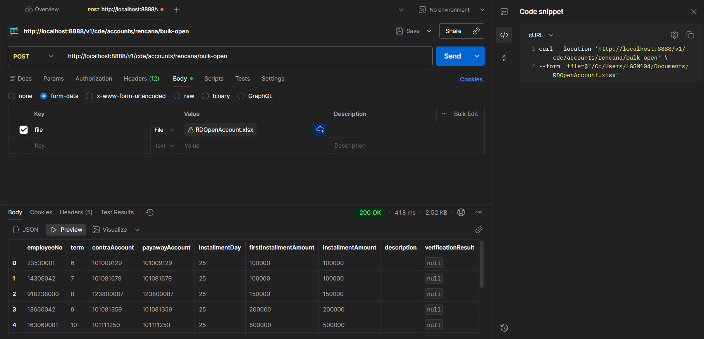

# CDE Star Planning - Bulk Open Account (Upload & Download Excel File)

## 1. Excel File
[RDOpenAccount.xlsx](RDOpenAccount.xlsx)

## 2. Build Projects
```shell
$ ./mvnw clean install
...
[INFO] ext_cbs ............................................ SUCCESS [  1.737 s]
[INFO] ext_cbs_api ........................................ SUCCESS [  1.905 s]
[INFO] cde-star-planning .................................. SUCCESS [  0.007 s]
[INFO] ------------------------------------------------------------------------
[INFO] BUILD SUCCESS
[INFO] ------------------------------------------------------------------------
...
```

## 3. Bulk Open Account

### 3.1 UI
#### 3.1.1 Running Spring Boot
```shell
$ ./mvnw -f ext_cbs_ui/pom.xml spring-boot:run

  .   ____          _            __ _ _
 /\\ / ___'_ __ _ _(_)_ __  __ _ \ \ \ \
( ( )\___ | '_ | '_| | '_ \/ _` | \ \ \ \
 \\/  ___)| |_)| | | | | || (_| |  ) ) ) )
  '  |____| .__|_| |_|_| |_\__, | / / / /
 =========|_|==============|___/=/_/_/_/
 :: Spring Boot ::               (v2.7.18)

2025-11-16 10:20:32.132  INFO 28740 --- [           main] id.dph.cde.ExtCbsUiApplication           : Starting ExtCbsUiApplication using Java 1.8.0_371 on LGSM-Laptop104 with PID 28740 (D:\Labs\cde-star-planning\ext_cbs_ui\target\classes started by LGSM104 in D:\Labs\cde-star-planning\ext_cbs_ui)
2025-11-16 10:20:32.134  INFO 28740 --- [           main] id.dph.cde.ExtCbsUiApplication           : No active profile set, falling back to 1 default profile: "default"
2025-11-16 10:20:32.862  INFO 28740 --- [           main] o.s.b.w.embedded.tomcat.TomcatWebServer  : Tomcat initialized with port(s): 8880 (http)
2025-11-16 10:20:32.868  INFO 28740 --- [           main] o.apache.catalina.core.StandardService   : Starting service [Tomcat]
2025-11-16 10:20:32.869  INFO 28740 --- [           main] org.apache.catalina.core.StandardEngine  : Starting Servlet engine: [Apache Tomcat/9.0.83]
2025-11-16 10:20:32.974  INFO 28740 --- [           main] o.a.c.c.C.[Tomcat].[localhost].[/]       : Initializing Spring embedded WebApplicationContext
2025-11-16 10:20:32.974  INFO 28740 --- [           main] w.s.c.ServletWebServerApplicationContext : Root WebApplicationContext: initialization completed in 812 ms
2025-11-16 10:20:33.169  INFO 28740 --- [           main] o.s.b.w.embedded.tomcat.TomcatWebServer  : Tomcat started on port(s): 8880 (http) with context path ''
2025-11-16 10:20:33.174  INFO 28740 --- [           main] id.dph.cde.ExtCbsUiApplication           : Started ExtCbsUiApplication in 1.284 seconds (JVM running for 1.592)
```

#### 3.1.2 Web Browser


### 3.2 API
#### 3.2.1 Running Spring Boot
```shell
$ ./mvnw -f ext_cbs_api/pom.xml spring-boot:run

  .   ____          _            __ _ _
 /\\ / ___'_ __ _ _(_)_ __  __ _ \ \ \ \
( ( )\___ | '_ | '_| | '_ \/ _` | \ \ \ \
 \\/  ___)| |_)| | | | | || (_| |  ) ) ) )
  '  |____| .__|_| |_|_| |_\__, | / / / /
 =========|_|==============|___/=/_/_/_/
 :: Spring Boot ::               (v2.7.18)
2025-11-15 22:14:53.474  INFO 29968 --- [           main] c.f.rencana.api.ExtCbsApiApplication     : Starting ExtCbsApiApplication using Java 1.8.0_371 on LGSM-Laptop104 with PID 29968 (D:\Labs\cde-star-planning\ext_cbs_api\target\classes started by LGSM104 in D:\Labs\cde-star-planning\ext_cbs_api)
2025-11-15 22:14:53.476  INFO 29968 --- [           main] c.f.rencana.api.ExtCbsApiApplication     : No active profile set, falling back to 1 default profile: "default"
2025-11-15 22:14:54.202  INFO 29968 --- [           main] o.s.b.w.embedded.tomcat.TomcatWebServer  : Tomcat initialized with port(s): 8888 (http)
2025-11-15 22:14:54.207  INFO 29968 --- [           main] o.apache.catalina.core.StandardService   : Starting service [Tomcat]
2025-11-15 22:14:54.207  INFO 29968 --- [           main] org.apache.catalina.core.StandardEngine  : Starting Servlet engine: [Apache Tomcat/9.0.83]
2025-11-15 22:14:54.311  INFO 29968 --- [           main] o.a.c.c.C.[Tomcat].[localhost].[/]       : Initializing Spring embedded WebApplicationContext
2025-11-15 22:14:54.311  INFO 29968 --- [           main] w.s.c.ServletWebServerApplicationContext : Root WebApplicationContext: initialization completed in 808 ms
2025-11-15 22:14:54.501  INFO 29968 --- [           main] o.s.b.w.embedded.tomcat.TomcatWebServer  : Tomcat started on port(s): 8888 (http) with context path ''
2025-11-15 22:14:54.507  INFO 29968 --- [           main] c.f.rencana.api.ExtCbsApiApplication     : Started ExtCbsApiApplication in 1.276 seconds (JVM running for 1.581)
```

#### 3.2.2 Postman

